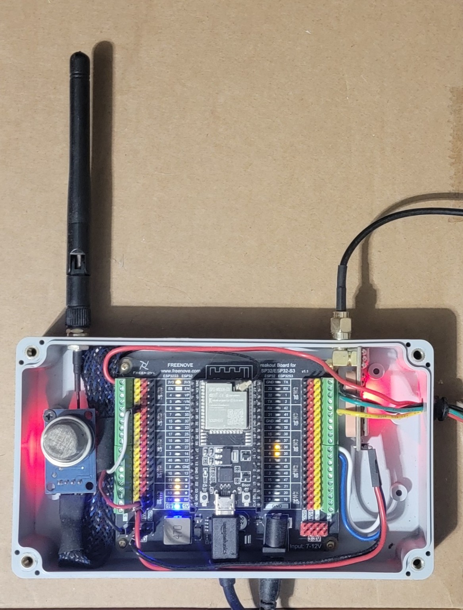

<p align="center">
  
</p>

# The Orchard

> An open-source environmental DePIN (Decentralized Physical Infrastructure Network) on the [Chia blockchain](https://www.chia.net/). Plant a low-cost ESP32-S3 **Tree**, harvest verifiable environmental data, earn **$JUICE**.

**Status:** Proof of concept. Pre-alpha. Things will break. Help us fix them.

<p align="center">
  
  <br>
  <em>The first Tree — Freenove ESP32-S3 + MQ-135 + GPS in a clear ABS enclosure, Mount Washington, KY.</em>
</p>

---

## What is this?

The Orchard turns inexpensive ESP32-based hardware into **verifiable environmental sensing Trees**. Each Tree:

- Measures the world around it (air quality, temperature, humidity, pressure, light, particulates, GPS, more later).
- Signs and submits readings to a local **oracle** service.
- Has its **uptime attested** every Season to the Chia DataLayer (a verifiable on-chain key/value store).
- Earns **$JUICE** — a Chia CAT token — proportional to verified uptime.
- Is bound to a wallet via an **Orchard Pass** (NFT credential) that proves ownership.

The goal is a community-buildable network of climate / air-quality / location-verified sensors that anyone can deploy, extend, and earn from. Hardware design, firmware, dashboards, oracle, and reward logic are all open source.

The token supports the ecosystem instead of being the ecosystem. See [docs/VISION.md](docs/VISION.md) for the long-term direction.

---

## Architecture at a glance

```
 ┌──────────────┐   sensor JSON    ┌───────────────┐  Season attest.  ┌──────────────┐
 │   Tree       │ ───── HTTPS ───▶ │ Local Oracle  │ ────RPC────────▶ │ Chia         │
 │   (ESP32-S3) │                  │  (FastAPI +   │                  │ DataLayer    │
 │              │ ◀── OTA / WiFi ──│   SQLite)     │                  │              │
 └──────────────┘   provisioning   └───────────────┘                  └──────────────┘
        ▲                                  ▲                                  │
        │                                  │ live readings                    │
        │ USB-serial                       │                                  ▼
        │                          ┌───────────────┐                  ┌──────────────┐
        └───── scan / config ──────│ Orchard View  │                  │ Season       │
                                   │  (Flask, run  │                  │ harvest      │
                                   │   on your PC) │                  │ script       │
                                   └───────────────┘                  │ → $JUICE     │
                                                                      │   spend      │
                                                                      └──────────────┘
                                                                              │
                                                                              ▼
                                                                       ┌──────────────┐
                                                                       │  Tree-owner  │
                                                                       │  wallets     │
                                                                       └──────────────┘
```

| Component       | What it does                                                                 | Path           |
|-----------------|------------------------------------------------------------------------------|----------------|
| **firmware/**   | Tree firmware (ESP32-S3). Modular sensor drivers. WiFi, GPS, signed POSTs, OTA. | [firmware/](firmware/) |
| **oracle/**     | FastAPI service. Receives readings, stores in SQLite, tracks Season uptime.  | [oracle/](oracle/) |
| **dashboard/**  | **Orchard View** — local Flask web UI. Scan, view readings, push WiFi/OTA, register Tree. | [dashboard/](dashboard/) |
| **orchard_chia/**| DataLayer writer + Chia wallet client + manual $JUICE Season-harvest script. | [orchard_chia/](orchard_chia/) |
| **nft/**        | **Orchard Pass** NFT collection (CHIP-7 metadata) + mint script.             | [nft/](nft/) |
| **docs/**       | Wiring diagrams, decision records (ADRs), VISION, LOG of successes & failures. | [docs/](docs/) |
| **examples/**   | Copy/paste templates so novices can extend (new sensors, new node types).    | [examples/](examples/) |

See [docs/decisions/0001-v1-architecture.md](docs/decisions/0001-v1-architecture.md) for the v1 design decisions and why they were made. See [docs/VISION.md](docs/VISION.md) for where we're heading long term.

---

## The token: $JUICE

<p align="center">
  
</p>

| Field          | Value                                                                |
|----------------|----------------------------------------------------------------------|
| Name           | $JUICE                                                               |
| Type           | CAT (Chia Asset Token)                                               |
| Network        | Chia mainnet                                                         |
| Asset ID       | `285164e6af80202d2b07fa3cc6ae47ff2906029365a83c50fcab25a56b937121`   |
| Eve Coin ID    | `2ff338ed6fb3161d48eed7f112d3c6077e90c517dc4534bfba8ad3975b7f5e63`   |
| Total supply   | 100,000,000 JUICE                                                    |
| Issuance       | Single issuance                                                      |

Full token reference: [docs/token/JUICE.md](docs/token/JUICE.md). The Asset ID also lives in `orchard_chia/config.example.yaml` — copy to `orchard_chia/config.yaml`, fill in your local wallet details, and don't commit your local copy (it's in `.gitignore`).

---

## Reward model (v1, tunable)

| Parameter       | Value                                       |
|-----------------|---------------------------------------------|
| Daily rate      | 1 $JUICE per Tree per day                   |
| Accrual         | 1/24 $JUICE per verified hour of uptime     |
| Season length   | 4608 Chia blocks (~24h)                     |
| Credential      | 1 Orchard Pass per wallet                   |
| Payout method   | Manual batched $JUICE CAT spend bundle (Phase 7) |

All of these are **config, not constants** — they will scale up after initial testing.

---

## Glossary

User-facing copy uses brand names. Code uses technical equivalents. This table is the mapping.

| Brand name        | In code                       | Description                                       |
|-------------------|-------------------------------|---------------------------------------------------|
| The Orchard       | `orchard`                     | The ecosystem                                     |
| $JUICE            | `juice` / CAT asset id        | Reward token                                      |
| Tree              | `node`, `node_id`             | A deployed sensing device                         |
| Grove             | `grove`, `grove_id`           | A cluster of Trees                                |
| Season            | `season`, `season_blocks`     | A reward cycle (4608 Chia blocks ≈ 24h)           |
| Harvest           | `readings`, `harvest_batch`   | Data collection / payout event                    |
| Keeper            | `keeper`, `validator`         | A submission validator (v2+; not implemented v1)  |
| Orchard View      | `dashboard`                   | The local Flask UI                                |
| Orchard Pass      | `pass`, `pass_id`             | NFT credential proving Tree ownership             |

---

## Quick start

> Setup automation is being written. For now this is a placeholder so you know what's coming.

```bash
# 1. Clone
git clone https://github.com/FlipThisCrypto/the-orchard.git
cd the-orchard

# 2. Install dashboard + oracle (Python 3.11+)
python -m venv .venv
.venv\Scripts\activate            # Windows
# source .venv/bin/activate       # macOS / Linux
pip install -r oracle/requirements.txt -r dashboard/requirements.txt

# 3. Start the local oracle
python -m oracle.app.main         # default: http://localhost:8000

# 4. Start Orchard View (new shell)
python -m dashboard.app           # default: http://localhost:5000

# 5. Plug your Tree (ESP32) in via USB, open Orchard View, follow the
#    "Plant a new Tree" wizard.
```

Full setup, sensor wiring, and Chia node configuration: see [docs/](docs/).

---

## Hardware (current PoC reference build)

- [Freenove ESP32-S3 dev board](https://store.freenove.com/products/fnk0083) (on Freenove breakout)
- [MQ-135 air quality sensor](https://www.winsen-sensor.com/sensors/co2-sensor/mq135.html) (analog)
- [NEO-6M / 7M / 8M GPS module](https://www.u-blox.com/en/product/neo-6-series) with corded active antenna
- WiFi/Bluetooth antenna (~4")
- Clear ABS waterproof enclosure
- USB-C cable for power + dev

Sensors **planned** (drivers will be modular so you can add or skip any):

- AHT20 (temp + humidity, I2C)
- BMP280 (pressure, I2C)
- BH1750 (light, I2C)
- PMS5003 (PM2.5 particulate, UART)
- Current transformers + voltage sensors (power monitoring)
- CO2, geophone, weather sensors (future — see [VISION.md](docs/VISION.md))

See [docs/wiring/](docs/wiring/) for per-sensor wiring tables.

---

## Build it yourself

If you want to plant a Tree, contribute a sensor driver, or fork the whole thing for your own DePIN: please do. The whole point is to be forkable. See [CONTRIBUTING.md](CONTRIBUTING.md).

If you want to read what worked and what didn't during development (and learn from our mistakes): see [docs/LOG.md](docs/LOG.md).

If you want to know where this is heading over the next few years: see [docs/VISION.md](docs/VISION.md).

---

## License

[Apache License 2.0](LICENSE). Includes an explicit patent grant — important for an infrastructure project.

---

## Status & roadmap

This project is in active development. Current phase:

- [x] Phase 1 — Repo skeleton, license, docs scaffold, vision documented
- [ ] Phase 2 — Tree firmware v1 (ESP32-S3, modular, signed POSTs, OTA)
- [ ] Phase 3 — Oracle service (FastAPI + SQLite)
- [ ] Phase 4 — Orchard View (local Flask dashboard)
- [ ] Phase 5 — Season attestation writer (DataLayer)
- [ ] Phase 6 — Orchard Pass NFT collection mint
- [ ] Phase 7 — Season harvest ($JUICE payout)
